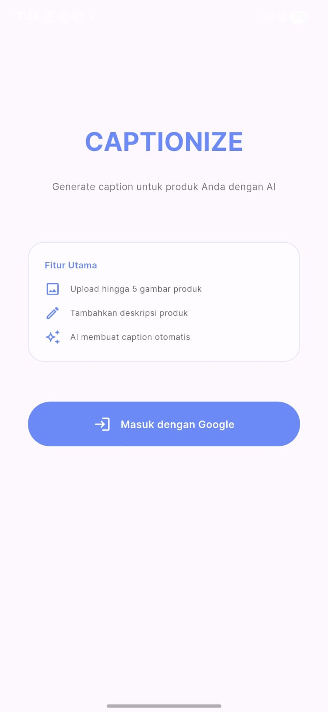
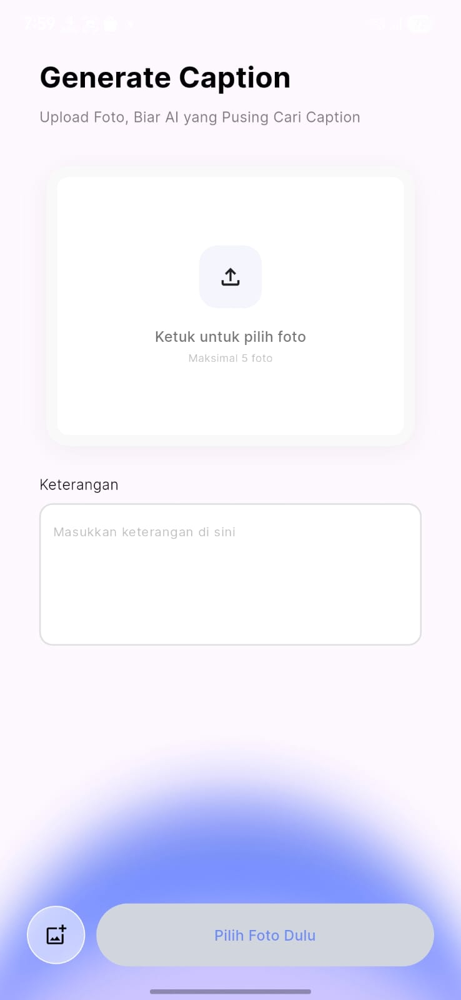
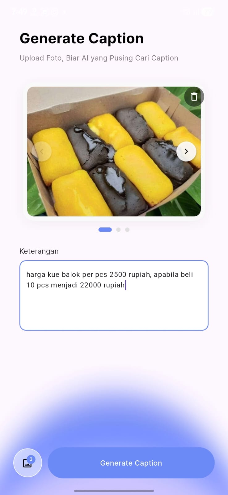
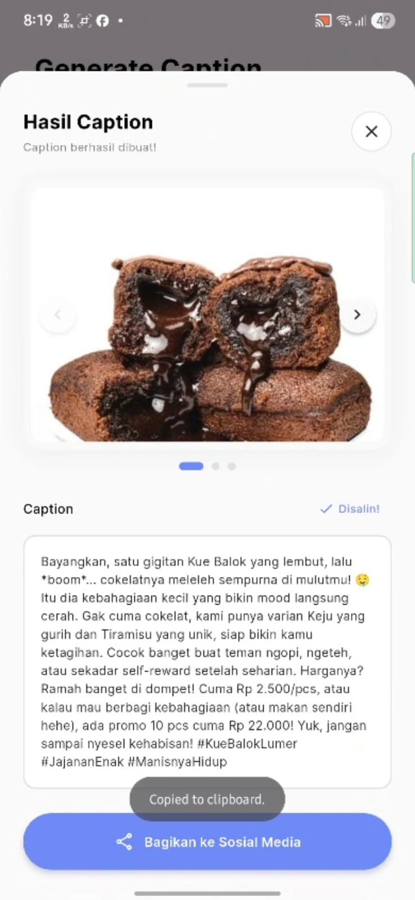

# Dokumentasi CAPTIONIZE 📸

Panduan lengkap tentang cara menggunakan aplikasi CAPTIONIZE untuk menghasilkan caption produk menggunakan AI.

---

## 📋 Daftar Isi

1. [Pendahuluan](#pendahuluan)
2. [Panduan Memulai - Login dengan Google](#panduan-memulai)
3. [Fitur Utama](#fitur-utama)
4. [Cara Penggunaan](#cara-penggunaan)
5. [Panduan Fitur Lengkap](#panduan-fitur-lengkap)
6. [Troubleshooting](#troubleshooting)
7. [Persyaratan Sistem](#persyaratan-sistem)
8. [Instalasi & Setup (Untuk Developer)](#instalasi--setup)

---

## 🎯 Pendahuluan

**CAPTIONIZE** adalah aplikasi mobile yang membantu Anda membuat caption (deskripsi) produk secara otomatis menggunakan teknologi Artificial Intelligence (AI). Aplikasi ini sempurna untuk:

- Penjual online yang membutuhkan deskripsi produk berkualitas tinggi
- Content creator yang ingin mempercepat proses pembuatan deskripsi
- E-commerce manager yang mengelola ribuan produk
- Siapa saja yang ingin menghemat waktu dalam membuat caption produk

### Fitur Unggulan:
- ✅ Generate caption otomatis dari foto produk
- ✅ Dukungan multi-platform (iOS, Android, Web, Windows)
- ✅ Login dengan Google untuk keamanan
- ✅ Interface yang user-friendly dan intuitif
- ✅ Bagikan caption langsung ke media sosial
- ✅ Copy caption otomatis ke clipboard

---

## 💻 Persyaratan Sistem

### Untuk Menjalankan Aplikasi:
- **iOS**: iOS 11.0 atau lebih tinggi
- **Android**: Android 5.0 (API level 21) atau lebih tinggi
- **Web**: Browser modern (Chrome, Firefox, Safari, Edge)
- **Windows**: Windows 10 atau lebih tinggi

### Untuk Development:
- Flutter SDK 3.5.0 atau lebih tinggi
- Dart 3.5.0 atau lebih tinggi
- Git
- IDE: Visual Studio Code, Android Studio, atau Xcode

---

## 🚀 Instalasi & Setup

### 1. Clone Repository

```bash
git clone <repository-url>
cd imphenhackaton
```

### 2. Install Dependencies

```bash
flutter pub get
```

### 3. Setup Environment Variables

Buat file `.env` di root directory project:

```env
# Tambahkan konfigurasi yang diperlukan
API_BASE_URL=<your-api-url>
API_KEY=<your-api-key>
```

### 4. Generate Localization Files

```bash
flutter gen-l10n --arb-dir="lib/l10n/arb"
```

### 5. Jalankan Aplikasi

Pilih salah satu flavor yang tersedia:

```bash
# Development
flutter run --flavor development --target lib/main_development.dart

# Staging
flutter run --flavor staging --target lib/main_staging.dart

# Production
flutter run --flavor production --target lib/main_production.dart
```

---

## 🎮 Panduan Memulai

### Step 1: Buka Aplikasi

Saat pertama kali membuka aplikasi, Anda akan melihat splash screen CAPTIONIZE.

### Step 2: Login dengan Google



Proses login adalah langkah pertama yang harus Anda lakukan:

1. **Tekan tombol "Login dengan Google"**
   - Di halaman login, cari dan tekan tombol besar bertulisan "Login dengan Google"
   - Tombol ini biasanya berwarna biru dengan logo Google

2. **Pilih Akun Google Anda**
   - Jendela Google Sign-In akan terbuka
   - Pilih akun Google yang ingin Anda gunakan
   - Jika belum login, masukkan email dan password Google Anda

3. **Berikan Izin Akses**
   - Review permission yang diminta aplikasi
   - Izin yang diminta:
     - Akses profil Google (nama, email, foto)
     - Akses kamera untuk mengambil foto
     - Akses galeri/storage untuk memilih foto
   - Tekan tombol **"Lanjutkan"** atau **"Izinkan"**

4. **Proses Login Selesai**
   - Aplikasi akan memproses login Anda
   - Tunggu beberapa detik sampai proses selesai
   - Anda akan diarahkan ke halaman utama aplikasi

### Step 3: Mulai Generate Caption

Setelah login berhasil, Anda langsung masuk ke halaman **Generate Caption** dan siap membuat caption produk Anda!

### Troubleshooting Login

#### Masalah: "Login gagal" atau error saat login

**Solusi:**
- Pastikan koneksi internet Anda stabil
- Cek apakah akun Google sudah diverifikasi
- Hapus cache aplikasi dan coba login lagi
- Restart aplikasi dan ulangi proses login

#### Masalah: Tombol "Login dengan Google" tidak merespons

**Solusi:**
- Tunggu beberapa detik, mungkin sedang loading
- Cek koneksi internet
- Restart aplikasi
- Update aplikasi ke versi terbaru

#### Masalah: Permission diminta berkali-kali

**Solusi:**
- Izinkan semua permission yang diminta
- Jangan batalkan saat proses login berlangsung
- Jika tetap diminta, uninstall dan reinstall aplikasi

#### Masalah: Redirect halaman tidak terjadi setelah login

**Solusi:**
- Tunggu beberapa detik lebih lama
- Periksa koneksi internet
- Restart aplikasi dan login ulang
- Jika masalah berlanjut, hubungi support

---

## ⭐ Fitur Utama

### 1. **Fitur Generate Caption** 🤖
Fitur utama yang memungkinkan Anda membuat caption produk dengan AI.

- **Input**: Upload foto produk (1 atau lebih)
- **Proses**: AI menganalisis gambar produk
- **Output**: Caption yang deskriptif dan menarik untuk produk

### 2. **Fitur Autentikasi** 🔐
Login aman menggunakan Google Sign-In.

- Login dengan akun Google
- Session management otomatis
- Logout kapan saja

### 3. **Fitur Share** 📤
Bagikan caption yang sudah dibuat.

- Share via WhatsApp
- Share via Email
- Share via Social Media
- Copy ke clipboard

---

## 📖 Cara Penggunaan

### Menghasilkan Caption Produk

Proses sangat simpel, hanya 3 langkah untuk membuat caption produk!

#### Langkah 1: Pilih Foto Produk

Setelah login, Anda langsung masuk ke halaman **"Generate Caption"**.



**Yang Anda lihat:**
- Area besar di tengah bertuliskan **"Ketuk untuk pilih foto"** dengan icon upload
- Field **"Keterangan"** di bawah untuk deskripsi produk
- Tombol **"Generate Caption"** di bagian bawah

**Yang Anda lakukan:**
1. **Ketuk area foto** (area yang bertuliskan "Ketuk untuk pilih foto")
2. Pilih 1 atau lebih foto dari galeri ponsel Anda
3. Foto akan tampil di area tersebut
4. Bisa lihat foto dari berbagai sudut dengan tombol navigasi (< >)

#### Langkah 2: Isi Deskripsi Produk (Opsional)

Setelah foto terpilih, Anda bisa menambahkan deskripsi produk:

**Di field "Keterangan", ketik:**
- Nama produk
- Warna dan ukuran
- Material/bahan
- Harga dan promo
- Fitur khusus produk

**Contoh:**
```
Kue Balok Coklat lembut, harga Rp 2.500 per pcs. 
Beli 10 pcs jadi Rp 22.000. Cocok untuk hadiah atau self-reward.
```

**Tips:** Semakin detail deskripsi, semakin bagus caption yang dihasilkan AI.

#### Langkah 3: Generate Caption

1. **Tekan tombol "Generate Caption"** di bagian bawah
2. Tunggu beberapa detik (biasanya 3-10 detik)
3. Hasil caption akan langsung muncul di halaman baru

### Hasil & Share

Setelah caption dihasilkan, Anda akan melihat:

**Halaman "Hasil Caption" menampilkan:**
- Gambar produk Anda (bisa swipe untuk lihat foto lain)
- Caption yang sudah dibuat AI
- Status "Disalin!" dan tombol **"Bagikan ke Sosial Media"**



**Caption sudah otomatis dicopy ke clipboard** - Anda bisa langsung paste di mana saja.

**Untuk share:**
- Tekan tombol **"Bagikan ke Sosial Media"**
- Pilih platform (WhatsApp, Facebook, Instagram, dll)
- Caption akan dibagikan langsung ke platform pilihan


---

## 🎓 Panduan Fitur Lengkap

### Fitur Generate Caption (Detail)

#### Input Gambar:
- **Format yang didukung**: JPG, PNG, GIF, WebP
- **Ukuran maksimal**: 10 MB per gambar
- **Jumlah gambar**: Minimal 1, maksimal 5 gambar per request
- **Rekomendasi**: Gunakan gambar dengan resolusi tinggi untuk hasil terbaik

#### Tipe Produk yang Bisa Dihasilkan Caption:
- Pakaian dan fashion
- Elektronik
- Peralatan rumah tangga
- Kecantikan dan skincare
- Mainan dan hobi
- Perhiasan dan aksesoris
- Furniture
- Dan banyak lagi!

#### Tips untuk Hasil Terbaik:
1. **Gunakan foto berkualitas tinggi**
   - Pencahayaan yang baik
   - Fokus pada produk
   - Background tidak terlalu ramai

2. **Ambil dari berbagai sudut**
   - Tampak depan
   - Tampak samping
   - Detail produk

3. **Sertakan konteks**
   - Gunakan field deskripsi untuk memberikan informasi tambahan
   - Sebutkan material, warna, ukuran, fitur khusus

4. **Review hasil**
   - Cek caption yang dihasilkan
   - Edit jika ada bagian yang kurang sesuai
   - Sesuaikan dengan tone brand Anda

### Fitur Autentikasi (Detail)

#### Login Proses:
1. Aplikasi akan membuka Google Sign-In
2. Pilih akun Google yang ingin digunakan
3. Review permission yang diminta
4. Tekan "Lanjutkan" atau "Izinkan"
5. Aplikasi akan memproses login
6. Anda akan diarahkan ke halaman utama

#### Keamanan:
- Token disimpan secara aman di local storage
- Session akan expired setelah inaktif 24 jam
- Untuk login ulang, cukup tekan tombol login kembali

#### Logout:
1. Tekan menu profil (biasanya di atas layar)
2. Pilih **"Logout"** atau **"Sign Out"**
3. Anda akan diarahkan kembali ke halaman login

---

## 🐛 Troubleshooting

### Masalah: Aplikasi tidak bisa login

**Solusi:**
- Pastikan internet Anda stabil
- Cek apakah akun Google Anda sudah diverifikasi
- Hapus cache aplikasi dan coba lagi
- Restart aplikasi

### Masalah: Gambar tidak bisa diupload

**Solusi:**
- Periksa apakah ukuran gambar < 10 MB
- Pastikan format gambar yang didukung (JPG, PNG, GIF, WebP)
- Cek koneksi internet
- Coba dengan gambar lain

### Masalah: Caption tidak dihasilkan atau proses timeout

**Solusi:**
- Tunggu beberapa saat, proses mungkin sedang berjalan
- Periksa koneksi internet Anda
- Coba dengan gambar yang lebih sederhana
- Jika masalah berlanjut, restart aplikasi

### Masalah: Session expired atau logout otomatis

**Solusi:**
- Ini normal jika Anda belum aktif 24 jam
- Lakukan login kembali
- Pastikan token refresh berjalan dengan baik


### Masalah: Error "Terjadi kesalahan" tanpa penjelasan

**Solusi:**
- Catat waktu dan kondisi saat error terjadi
- Screenshot pesan error
- Laporkan ke tim developer dengan detail error
- Coba restart aplikasi

---

## 📱 Panduan Platform Spesifik

### iOS
- Buka App Store
- Cari "CAPTIONIZE"
- Tekan tombol "Get" atau "Cloud"
- Ikuti proses download dan instalasi
- Buka dari Home Screen

### Android
- Buka Google Play Store
- Cari "CAPTIONIZE"
- Tekan tombol "Install"
- Tunggu proses download
- Buka aplikasi setelah instalasi selesai

### Web
- Buka browser Anda (Chrome, Firefox, Safari)
- Ketik URL aplikasi web
- Aplikasi akan loading di browser
- Tidak perlu instalasi

### Windows
- Download installer dari website resmi
- Jalankan file installer
- Ikuti proses instalasi
- Buka dari Start Menu

---

## 📝 Tips & Trik

### Mengoptimalkan Penggunaan

1. **Batch Processing**
   - Generate beberapa caption sekaligus
   - Biarkan sistem memproses satu per satu
   - Hemat waktu dengan bulk process

2. **Template Caption**
   - Simpan caption favorit
   - Gunakan sebagai template untuk produk serupa
   - Edit sesuai kebutuhan

3. **Timing Optimal**
   - Generate caption pada jam-jam ramai traffic
   - Segera share untuk maksimalkan reach

4. **Variasi Gambar**
   - Gunakan gambar dari berbagai sudut
   - AI akan menghasilkan caption yang lebih komprehensif
   - Hasil akan lebih akurat

---

## 🔐 Privasi & Keamanan

### Data yang Kami Kumpulkan:
- Email dari akun Google
- Gambar yang Anda upload (untuk proses caption)
- Caption yang dihasilkan
- Log aktivitas untuk improvement

### Keamanan Data:
- Semua data terenkripsi dalam transit
- Database dilindungi dengan standar industri
- Tidak ada sharing data dengan pihak ketiga
- Anda bisa menghapus akun kapan saja

### Izin Aplikasi:
- **Camera**: Untuk mengambil foto produk
- **Gallery/Photo Library**: Untuk memilih foto dari galeri
- **Internet**: Untuk berkomunikasi dengan server
- **Google Sign-In**: Untuk autentikasi

---

## 📞 Dukungan & Bantuan

### Hubungi Tim Support:
- **Email**: support@captionize.app
- **WhatsApp**: +62-XXX-XXXX-XXXX
- **Live Chat**: Tersedia di website
- **FAQ**: Visit www.captionize.app/faq

### Laporkan Bug:
1. Buka menu help di aplikasi
2. Tekan "Laporkan Masalah"
3. Deskripsikan masalah secara detail
4. Sertakan screenshot jika diperlukan
5. Submit report

### Fitur Request:
Punya ide fitur baru? Kami ingin mendengarnya!
- Gunakan form feedback di aplikasi
- Email ke product@captionize.app
- Bergabung dengan komunitas user kami

---


## 🎉 Kesimpulan

CAPTIONIZE adalah solusi terbaik untuk menghemat waktu dalam membuat caption produk. Dengan teknologi AI terdepan, Anda dapat:

- ✅ Generate caption berkualitas tinggi dalam hitungan detik
- ✅ Fokus pada bisnis inti Anda
- ✅ Tingkatkan produktivitas hingga 10x lipat
- ✅ Dapatkan caption yang SEO-friendly

**Mulai gunakan CAPTIONIZE hari ini dan rasakan perbedaannya!**

---

## 📌 Quick Reference

| Fitur | Akses | Keterangan |
|-------|-------|-----------|
| Generate Caption | Menu Utama | Upload foto → Generate caption otomatis |

| Profile | Atas Layar | Lihat info profil & logout |
| Share | Halaman Hasil | Bagikan caption ke sosial media |
| Settings | Menu | Atur preferensi aplikasi |
| Help & Support | Menu | Akses bantuan dan FAQ |

---

**Terima kasih telah menggunakan CAPTIONIZE! 🚀**
